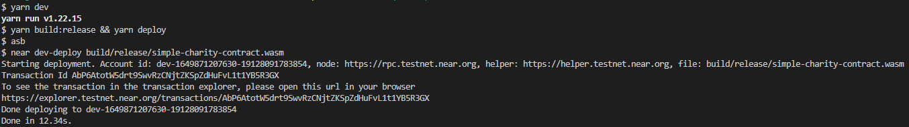
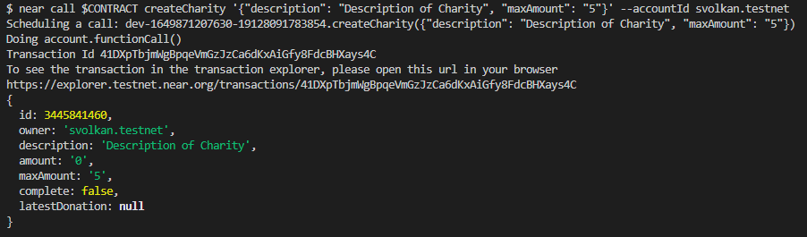
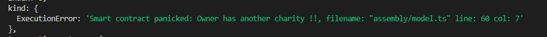
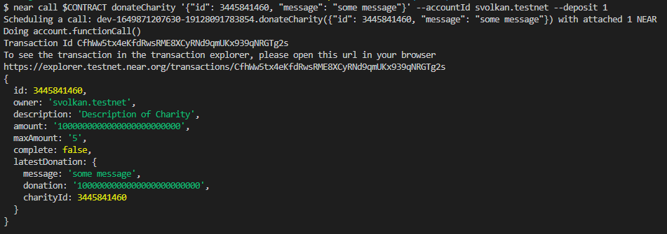
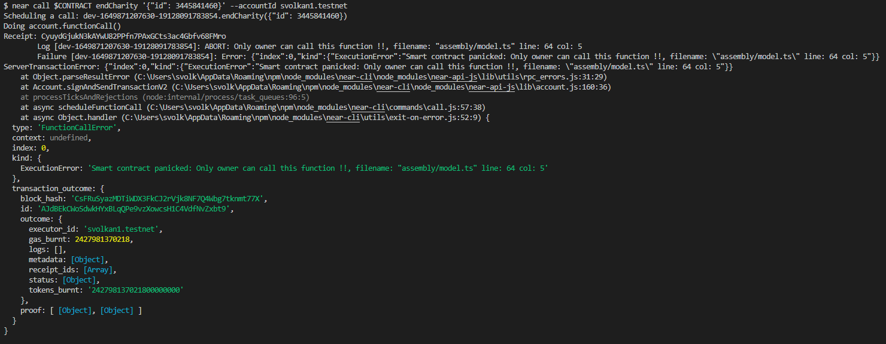
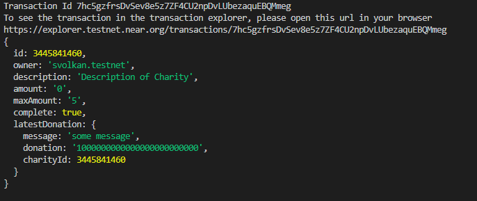
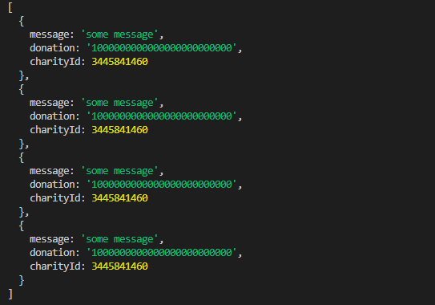

# Charity Smart Contract

In this project, a simple charity organization is replicated. The smart contract is capable of creating charity, accepting donations and finally closing the charity. Users can also look for the latest donationns and total amount collected in all charities.

[Project Loom Video](https://www.loom.com/share/d5197af2399940f28522694ccb60087d)

## Installation

```bash
git clone https://github.com/svozkan/simple-charity-contract
yarn
```

## How to Use Charity Smart Contract

First login to your account.

```bash
near login
```

Build and deploy the smart contract.

```bash
yarn dev
```


Export the development account to the $CONTRACT

```bash
export CONTRACT=dev-1649871207630-19128091783854
```

Create the charity.

```bash
near call $CONTRACT createCharity '{"description": "Description of Charity", "maxAmount": "5"}' --accountId svolkan.testnet
```



Charity owner cannot open another one until the first one is completed.



By using the following view calls charities can be viewed. getCharities function gets all charities between (start, start + limit).

```bash
near view $CONTRACT getCharitById '{"id": 3445841460}'

near view $CONTRACT getCharities '{"start": 0, "limit": 10}'
```

Calling donateCharity function adds your attached deposit to the Charity. Charity is defined with it's Id. Therefore, don't forget to type correct Id.

```bash
near call $CONTRACT donateCharity '{"id": 3445841460, "message": "some message"}' --accountId svolkan.testnet --deposit 1
```




Only the owner can close the charity.

```bash
near call $CONTRACT endCharity '{"id": 3445841460}' --accountId svolkan1.testnet
```



If the owner calls.



The last function shows the donation database hold in blockchain. This database keeps all donations made to all charities.

```bash
near view $CONTRACT LatestDonations '{"start": 0, "limit": 10}'
```

